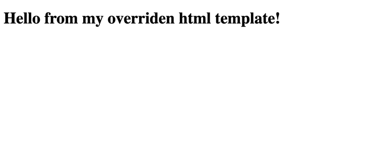
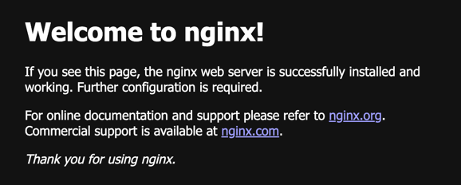

# Docker Compose Override & "`pull_policy: always`"

## Using `pull_policy:always`, you'll see the following html page:

## Removing the `pull_policy: always`, you'll see the default `docker.io/nginx:latest` html template:

